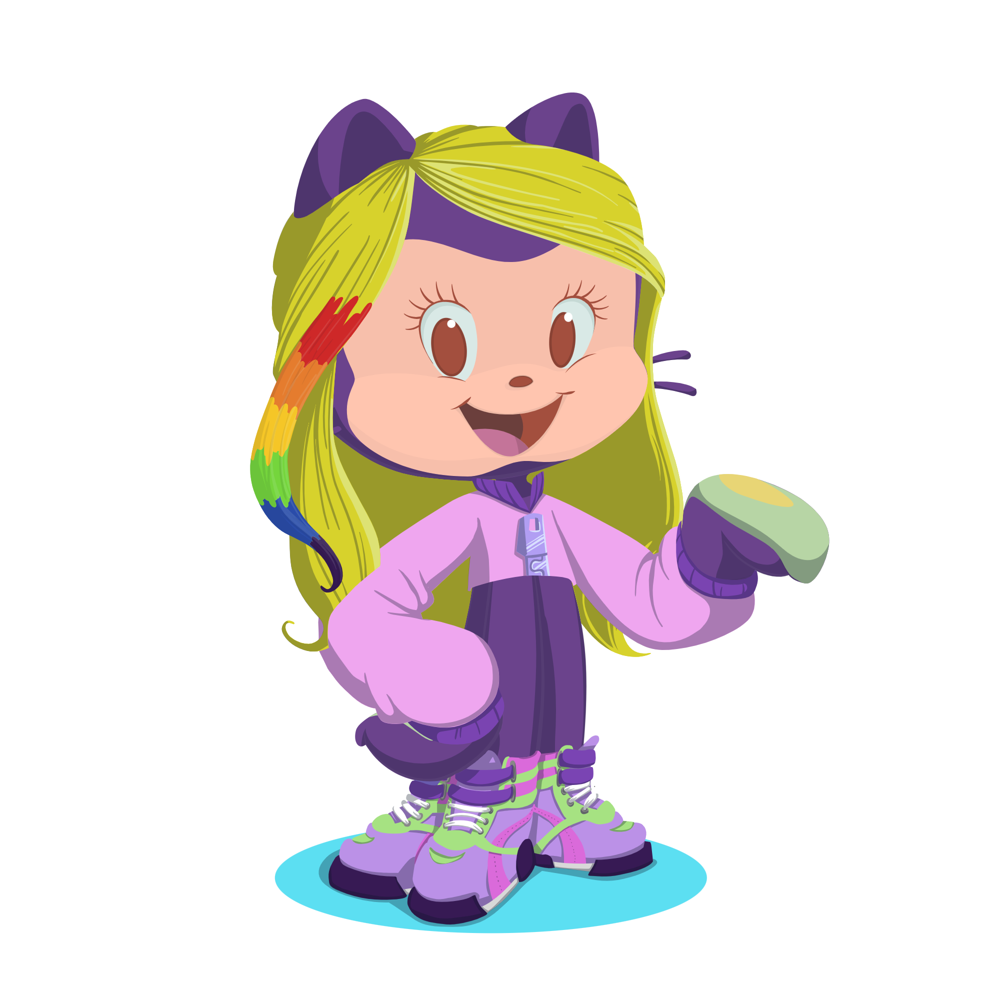

### Olá, meu nome é Camila e seja bem vindo ao meu perfil
Fique a vontade para ver meus projetos.👋👩🏻‍💻

-  👩🏻‍🎓Graduada em Analise de desenvolvimento de sistema
-  👩🏻‍🎓Concluí curso de Design UX/UI
-  🖥️Desenvolvendo projetos..
  
  

<a href="https://github.com/Camilasaampaio">

## Já aprendi:
 
 

          

## Contatos:

   

